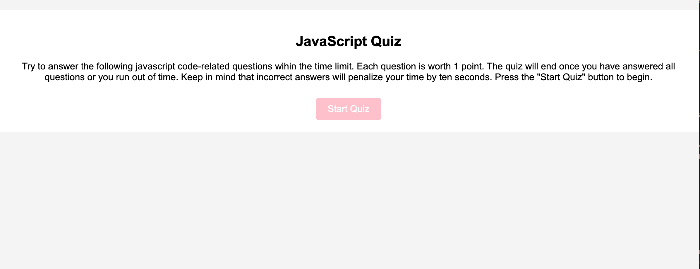
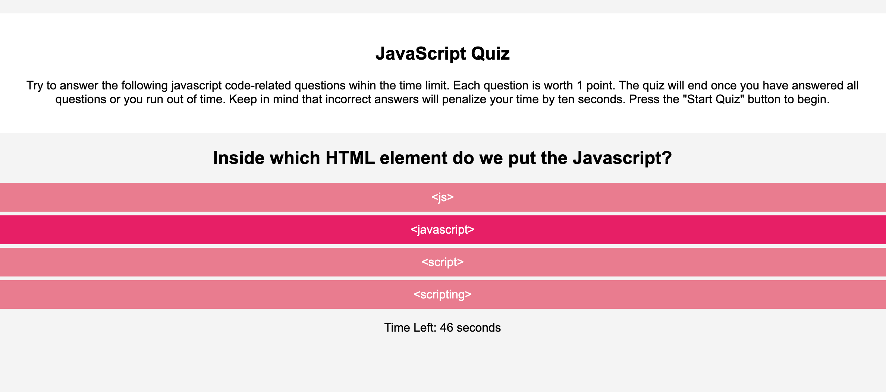
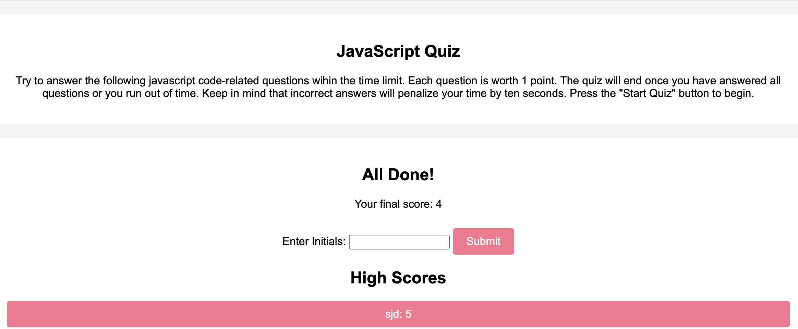

# javascript-quiz
A Javascript fundamentals code quiz using web APIs to create the code.

## Description

This is a webpage that was created using Javascript and web APIs to create a timed quiz about Javascrtip fundamentals. The user will be presented with a series of questions and will be given a score at the end. The user can save their high scores through the use of local storage coding.

## Installation

N/A

## Usage

To use this webpage, the user can click the "Start Quiz" button. The user will then be presented with a series of question and a timer will start. If a question is answered incorrectly, then 10 seconds will be subtracted from the timer. When all questions are answered or if the timer reaches 0, then the game is over. The user is then able to submit their initials and score and view all of their high scores.  

## Assets

The following images demonstrate the web application's appearance:

 

Here is the link to the deployed application:
https://sdavila210.github.io/javascript-quiz/

## Credits

Acknowledgments: Used Xpert Learning Assistant (especially for help with saveScore, getHighScores, and displayHighScores functions), used Module 4 activites and mini project, and developer.mozilla.org (MDN Docs) as resources to create code. Also used information from following website links: 
https://www.sitepoint.com/simple-javascript-quiz/
https://stackoverflow.com/questions/60037063/how-to-save-scores-in-javascript-quiz
https://dev.to/minna_xd/adding-a-high-score-table-to-javascript30-whack-a-mole-4adk
https://codedamn.com/news/javascript/create-new-elements-with-javascript
https://stackoverflow.com/questions/17773938/add-a-list-item-through-javascript#:~:text=If%20you%20want%20to%20create,createElement%20%5BMDN%5D.&text=For%20a%20simpler%20solution%2C%20you,it%20to%20the%20.

## License

MIT License (Please refer to license in repo)
